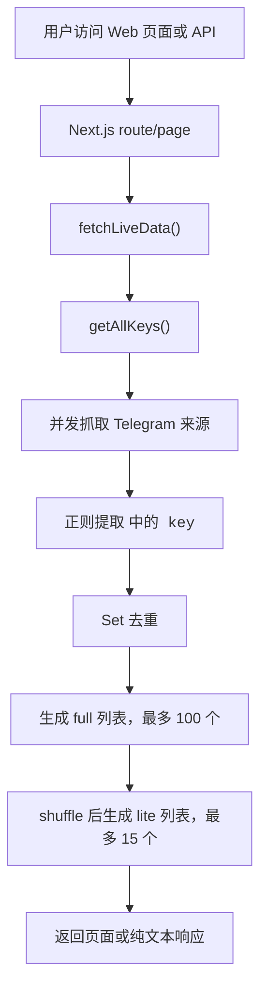

# 架构说明

## 技术栈

- Next.js 16 App Router：页面和 API route 都在 `app` 目录中。
- React 19：前端组件渲染。
- next-intl：通过 `app/[locale]` 和 `messages` 提供中英文界面。
- Tailwind CSS 和本地 UI 组件：承载页面布局、卡片、按钮和滚动区域。
- undici：当配置代理环境变量时，`lib/warp.ts` 使用 `ProxyAgent` 发起上游请求。

## 核心数据流



## 来源配置

公开来源在 `lib/warp.ts` 的 `SOURCES` 常量中维护：

```ts
const SOURCES = [
  "https://t.me/s/warpplus",
  "https://t.me/s/warppluscn",
  "https://t.me/s/warpPlusHome",
  "https://t.me/s/warp_veyke",
];
```

key 提取规则为：

```ts
const PATTERN = /<code>([A-Za-z0-9-]+)<\/code>/g;
```

如果 Telegram 页面结构变化，最可能需要调整的是 `PATTERN` 或 `SOURCES`。

## 列表生成规则

- `full`：当前请求抓取到的去重 key，最多返回 100 个。
- `lite`：从 `full` 中随机打乱后取最多 15 个。
- `lastUpdated`：当前请求生成列表时的 Unix 毫秒时间戳。
- `/api/diff`：当前主线不存储历史，因此返回 `added: []`、`removed: []`、`kept: full` 和说明字段。

## 缓存策略

API route 均声明 `dynamic = 'force-dynamic'`，避免被静态化。`/api/full` 和 `/api/lite` 返回：

```http
Cache-Control: s-maxage=10, stale-while-revalidate=30
Content-Type: text/plain
```

这意味着边缘缓存可以短时间复用响应，减少上游抓取压力，但仍保持接近实时。

## 代理支持

运行时按顺序读取以下环境变量：

```text
HTTPS_PROXY
https_proxy
HTTP_PROXY
http_proxy
ALL_PROXY
all_proxy
```

如果存在代理地址，抓取逻辑会使用 `undici` 的 `ProxyAgent`。示例：

```bash
HTTPS_PROXY=http://127.0.0.1:10808 pnpm dev
```

## 无状态设计

主线 Web 版本不写入数据库，也不写入 `data` 文件。好处是部署简单、适合 Serverless；代价是无法展示真正的历史新增、移除和稳定性曲线。如果需要落盘历史，可以基于旧版 Go 实现或新增数据库层。

## 安全边界

- `/api/full`、`/api/lite`、`/api/diff` 是公开接口。
- `/api/cron` 需要请求头 `Authorization: Bearer <CRON_SECRET>`。
- `CRON_SECRET` 不应提交到仓库，只能配置在 Vercel Environment Variables 或 GitHub Secrets 中。
- 上游来源是公开页面，返回内容需要按纯文本 key 使用，不建议把页面 HTML 直接渲染到前端。
